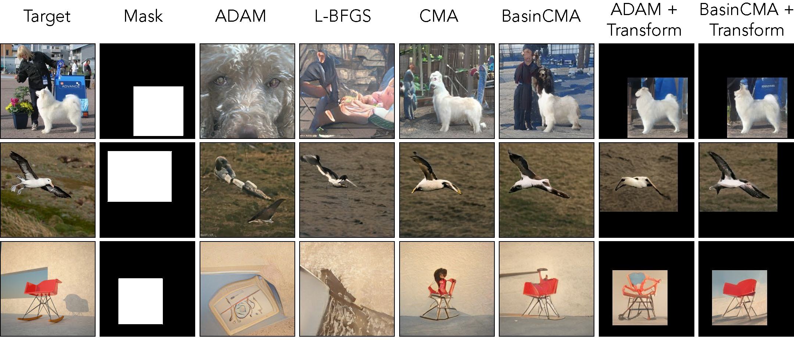

# GAN-Transform-and-Project


**Transforming and Projecting Images into Class-conditional Generative Networks**  
[Minyoung Huh](http://minyounghuh.com/) &nbsp; [Richard Zhang](https://richzhang.github.io/) &nbsp; [Jun-Yan Zhu](https://people.csail.mit.edu/junyanz/) &nbsp; [Sylvain Paris](http://people.csail.mit.edu/sparis/) &nbsp; [Aaron Hertzmann](https://www.dgp.toronto.edu/~hertzman/)  
MIT CSAIL &nbsp; Adobe Research  
[[Paper]]() &nbsp; [[Project Page]](https://minyoungg.github.io/GAN-Transform-and-Project/)  
<b>arXiv preprint 2020</b>   

## Prerequisites
The code was developed on
- Ubuntu 18.04
- Python 3.7
- PyTorch 1.2.0

We use the BigGAN port from HuggingFaces [github](https://github.com/huggingface/pytorch-pretrained-BigGAN)

## Setup
<b> (1) First install the python dependencies </b>
```bash
pip install -r requirements.txt
```

<b> (2) Clone LPIPS </b>  

The code uses perceptual similarity loss. We need to clone the LPIPS repo into this directory.
```bash
git clone https://github.com/richzhang/PerceptualSimilarity
```
The path should be in the following format ... or you can set the path manually in `init_paths.py`
```bash
./GAN-Transform-and-Project/PerceptualSimilarity
```

<b> (3) Encoder weights (optional)</b>   
The demo code uses encoder weights to speed up optimization.  
Download the weights from [google drive](https://drive.google.com/drive/folders/1CyDQGBlduBP7lk3WiwazsEViT7VJRnE_?usp=sharing) and place it in the `nets/weights` sub-directory.  

The encoder weight should be in the following path 
```bash
./GAN-Transform-and-Project/nets/weights/encoder.ckpt
```

## Demo
We provide several demos for our project. If you do not wish to use the encoder, disable them appropriately.

<b> (a) Jupyter demo </b>  
A jupyter lab/notebook demo is available in [example.ipynb](example.ipynb)

<b> (b) Command line </b>  
To run our code from command line
```bash
CUDA_VISIBLE_DEVICES=$GPU_ID python demo.py --im=$PATH_TO_IMAGE 
```
To see all valid options run `python demo.py --help`

<b> (c) Streamlit interactive demo </b>  
We provide interactive demo using Streamlit.

First `pip install streamlit` and then run
```
streamlit run st_interactive.py
```
Navigate to the posted `ip address` using your favorite browser.


## Developement
To get a glimpse on how to extend the work or invert images on your generative model. Take a look at [demo.py](demo.py)

<b> (a) Optimization </b>
We currently support `GradientOptimizer`, `CMAOptimizer`, `BasinCMAOptimizer`. We also have an experimental optimization methods using [NeverGrad](https://github.com/facebookresearch/nevergrad): `NevergradOptimizer` and `NevergradHybridOptimizer`. You can find the optimizers at [optimizer.py](./optimizer.py).

<b> (b) Transformation </b>
We support simple spatial affine transformation and various color transformations. A full list of transformation functions are available at [transform_functions.py](./utils/transform_functions.py). The transformation optimization details are in [transform.py](transform.py).

## Citation

If you found our work useful, please cite using
```
@article{huh2020ganprojection,
    title = {Transforming and Projecting Images to Class-conditional Generative Networks}
    author = {Huh, Minyoung and Zhang, Richard and Zhu, Jun-Yan
              and Paris, Sylvain and Hertzmann, Aaron},
    booktitle={arXiv preprint arXiv},
    year = {2020}
}
```
